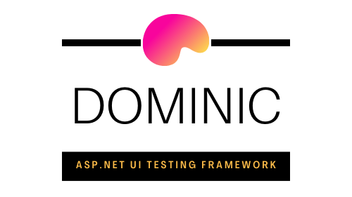

<p align="center">
  <a href="https://github.com/springerBuck/Dominic">
    
  </a>

  <h1 align="center">Dominic</h1>

  <p align="center">
    A library for UI testing cshtml.
    <br />
    <a href="https://github.com/springerBuck/Dominic"><strong>Explore the docs »</strong></a>
    <br />
    <br />
    <a href="https://github.com/springerBuck/Dominic/issues">Report Bug</a>
    ·
    <a href="https://github.com/springerBuck/Dominic/issues">Request Feature</a>
  </p>
</p>

[](https://github.com/springerBuck/Dominic/actions/workflows/build-and-test.yml)

## Table of Contents
 - [Installation](#installation)
 - [Configuring your project](#configuring-your-project)
 - [Features](#features)
 - [Philosophy](#philosophy)
 - [Quickstart](#quickstart)
 - [API](#api)
 - [How does it work?](#how-does-it-work?)
 - [How to Contribute](#how-to-Contribute)
 - [Acknowledgements](#acknowledgements)
 - [See also](#see-also)
 - [Support](#support)

## Installation
Dominic should be installed in the project coutaining your tests. You can install it with your favourite NuGet package manager, the `dotnet` cli, `Install-Package` cli or manually adding the reference to our `csproj`.

### Package Manager
`Install-Package Dominic`
### .NET CLI
`dotnet add package Dominic`
### PackageReference
Edit your `csproj` of the project containing your tests, and inside the `<ItemGroup>` add the reference to Dominic. See below for an example.

```
<ItemGroup>
    <PackageReference Include="Dominic" Version="1.0.0" />
</ItemGroup>
```

## Configuring your project
Dominic uses [RazorLight](https://github.com/toddams/RazorLight) to render your `cshtml` partials. A requirement of RazorLight is that `PreserveCompilationContext` is set to `true` in your `csproj` of the project where it is used. Failing to configure this will result in an `Exception` being thrown, more details can be found in the [GitHub Issue](https://github.com/toddams/RazorLight/issues/127). See below for an example of how to configure your `csproj`.

```
<PropertyGroup>
    ...
    <PreserveCompilationContext>true</PreserveCompilationContext>
    ...
</PropertyGroup>
```

## Features
TODO: add details here

## Philosophy
TODO: add details here

## Quickstart
TODO: add details here

## API
TODO: add details here

## How does it work?
TODO: add details here

## How to Contribute
Contributions are what make the open source community such an amazing place to be learn, inspire, and create. Any contributions you make are greatly appreciated. Before you jump into the code I would recommend you first read out [contiubuting guideline](CONTRIBUTING.md). The basic steps are as follows:

1. Clone the Project `git clone git@github.com:springerBuck/Dominic.git`
2. Create your Feature or Bug Branch `git checkout -b feature/cool-feature` or `git checkout -b bug/pesky-bug`
3. Commit your Changes `git commit -m 'Adds some cool feature'`. Please see the [Springer Nature Frontend Playbook](https://github.com/springernature/frontend-playbook/blob/main/git/git.md#commit-messages) for the expected commit message style.
4. Push to the Branch `git push origin feature/cool-feature`
5. Open a Pull Request

## Licence
Distributed under the MIT License. See `LICENSE` for more information.

## Acknowledgements
TODO: add details here

## See also
TODO: add details here

## Support
TODO: add details here